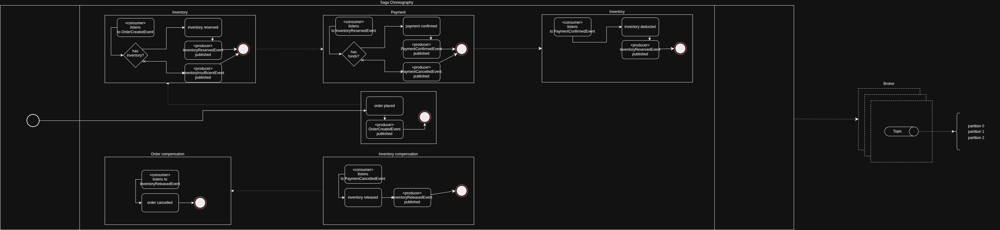

# Saga Choreography

## Event Choreography

### Happy flow
1. Order is created
2. OrderCreatedEvent is published
3. Inventory listens to OrderCreatedEvent
4. InventoryReservedEvent is pubished
5. Payment listens to InventoryReservedEvent
6. PaymentConfirmedEvent is published
7. Inventory listens to PaymentConfirmedEvent
8. InventoryDeductedEvent is publish

If needed more events and flows could be inserted listening to or being listened, such as shipment listening to InventoryDeductedEvent and so on.

### Unhappy flow
1. Order is created
2. OrderCreatedEvent is published
3. Inventory listens to OrderCreatedEvent
4. InventoryReservedEvent is pubished
5. Payment listens to InventoryReservedEvent
6. Payment verified that the client has no funds
7. PaymentCanceledEvent is published
8. Inventory listens to PaymentCanceledEvent
9. Inventory released item's quantity
10. InventoryReleasedEvent is published
11. Order listens to InventoryReleasedEvent
12. Order is canceled

For each failed processing an <Error>Event is published and listened on tier below, down to the first step of the flow, and this way all compensation is processed accordingly.

## Diagram

