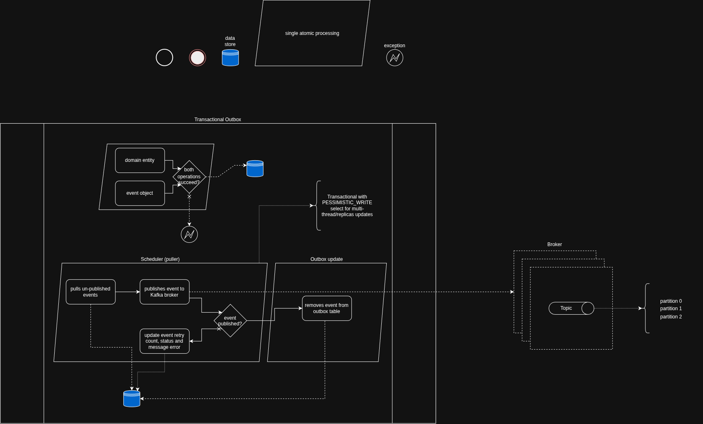

# Transactional Outbox

## Event Outbox Scheduler
### Event object

* Each event will be created -> processed and deleted when processing is successful
* Each event will be update with retry count, error_message and status if processing fails

```json
{
	"id":			"@GeneratedValue(strategy = GenerationType.UUID)"
	"createdDate":		"OffsetDateTime",
	"createdBy":		"String",
	"event":		"byte[]",
	"topic":		"String",
	"key":			"String",
	"status":		"String",
	"event_fqcn":		"String",
	"retries":		"Integer",
	"error_message":	"String"
}
```

_Event field annotated with @Lob @JdbcTypeCode(SqlTypes.BINARY) to map directly to binary data (byte[])_

_Status field annotated with @Enumerated(EnumType.STRING)_

### Configuration
* Outbox puller (Scheduler)
	* @Scheduled
	* Select with 
		* `@Lock(LockModeType.PESSIMISTIC_WRITE)`
		* @QueryHints({@QueryHint(name = "jakarta.persistence.lock.timeout", value = "-2")})
		
Desired select is:
```sql
SELECT * FROM tb_task 
ORDER BY createdDate ASC 
FOR UPDATE SKIP LOCKED 
LIMIT 1;
```

_LIMIT should be configurable via properties for single or batch processing as required._

## Diagram

